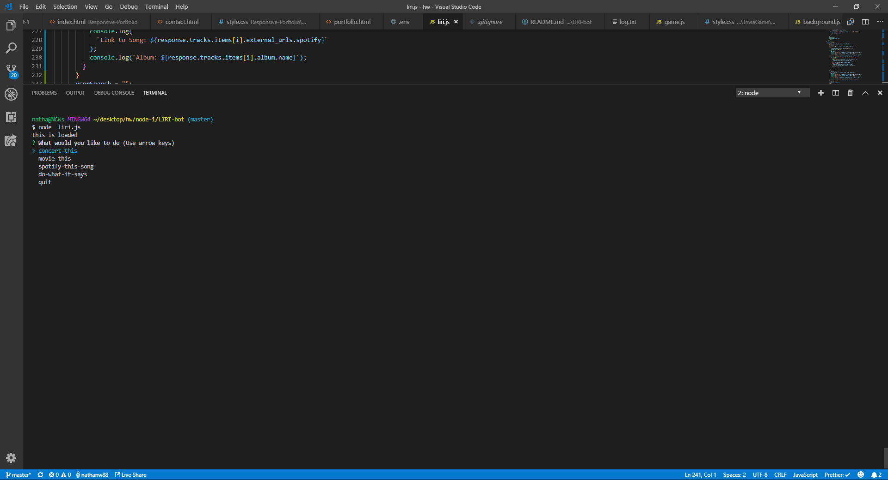
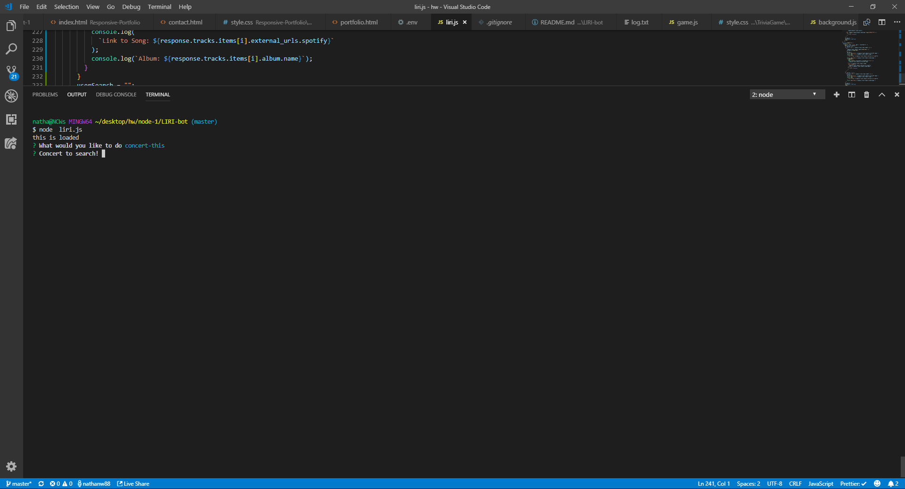
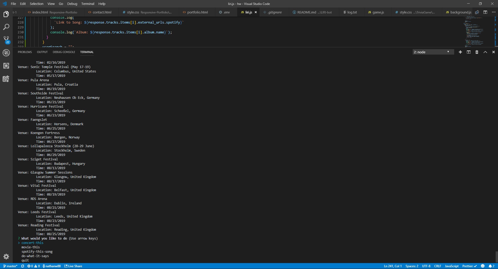
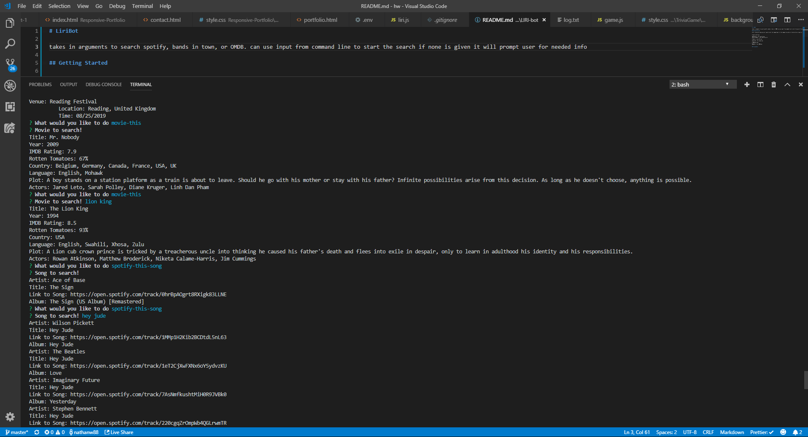
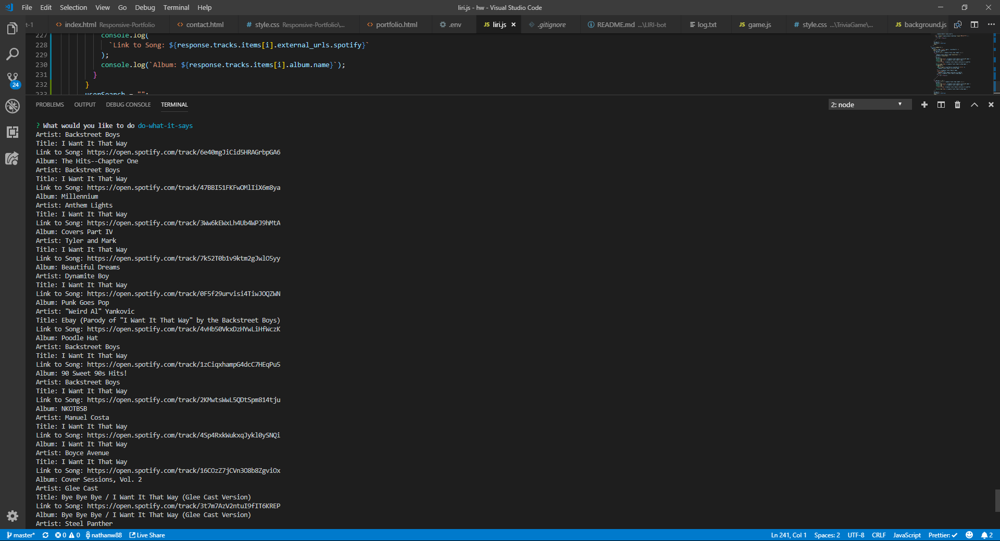
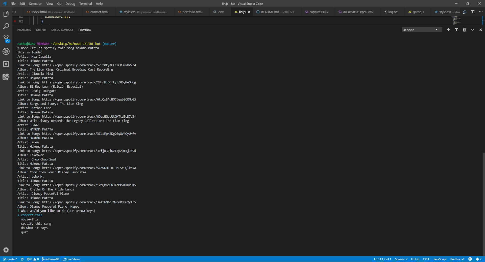

# LiriBot

Takes in arguments to search spotify, bands in town, or OMDB. can use input from command line to start the search if none is given it will prompt user for needed info. It will save all your searches to log.txt.

## Getting Started

After cloning this down you will need to enter the command npm i in the command line, while in the directiory you just cloned to install all the required node packages. You will need to make .env file with the requierd keys, in this format.

```
# Spotify API keys

SPOTIFY_ID = Your-spotify-key
SPOTIFY_SECRET = Your-spotify-secret

# Bands in town API keys

bands_API = Your-bands-key

# OMDB API keys

OMDB_API = Your-OMDB-key
```

## Screenshots

## Starting without an argument



## Upon selecting concert-this



## The results returned from concert this



## Results from movie & spotify



## Results from arguments in random.txt



## Passing in command line arguments


